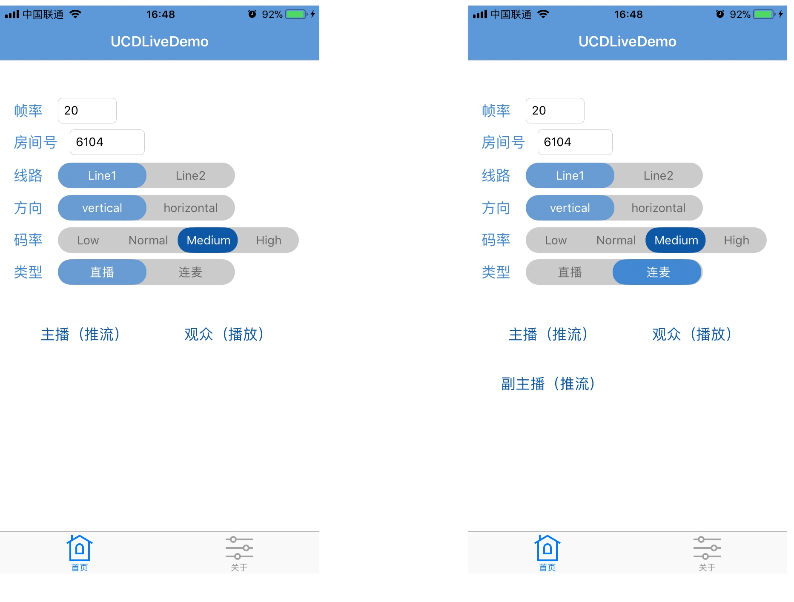
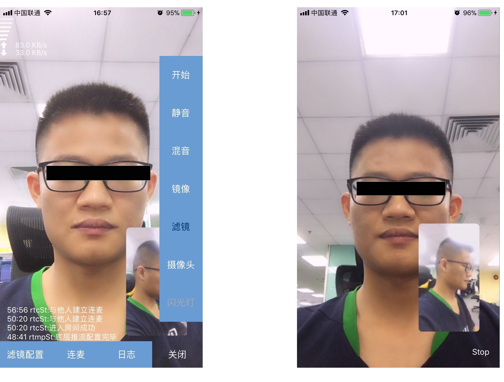
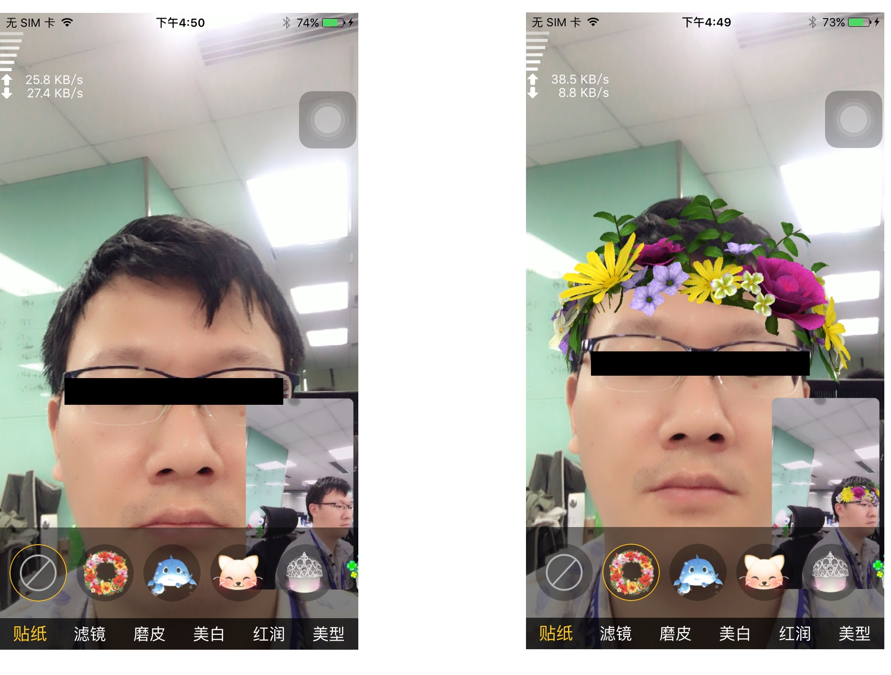
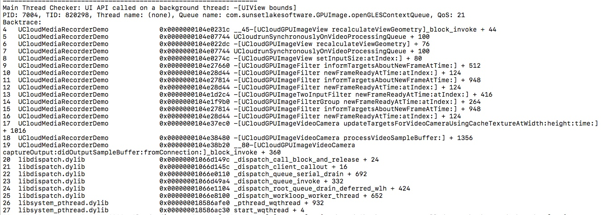
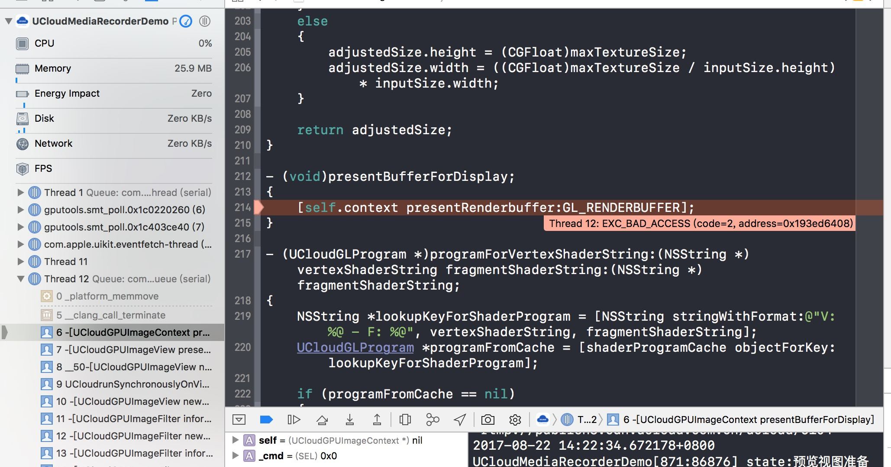

# [UCloud Live iOS SDK]() 

UCDLive SDK 是由 UCloud 提供的低延时、高并发的直播云服务。

  



- 1 [功能特性](#1)
- 2 [集成介绍](#2)
    - 2.1 [系统要求](#2.1)
    - 2.2 [下载集成](#2.2)
    - 2.3 [基础集成](#2.3)
- 3 [推流库集成](#3)
- 4 [连麦解决方案](#4)
- 5 [萌脸贴图](#5)
- 6 [播放器接入](#6)
- 7 [常见问题](#7)
- 8 [反馈和建议](#8)
- 9 [SDK升级历史信息文档变更](#9)

<a name="1"></a>
## 一. 功能特性
- [x] H.264硬编码
- [x] AAC 音频硬编码
- [x] RMTP协议直播推流
- [x] 提供基于GPUImage的美颜滤镜，并支持调节磨皮，美白，红润度
- [x] 支持自定义滤镜
- [x] 支持多分辨率设置
- [x] 自由码率设置
- [x] 自适应网络带宽码率调整
- [x] 弱网丢帧策略
- [x] 延时累积消除
- [x] 横竖屏推流
- [x] 支持视频镜像、非镜像操作
- [x] 自动对焦
- [x] 支持静音操作
- [x] 截帧操作
- [x] 动态贴纸(Faceu等)
- [x] 混音效果
- [x] 前后置摄像头动态切换
- [x] 在线API文档支持，提供 HeaderDoc 文档
- [x] 连麦解决方案

<a name="2"></a>
## 二. 集成介绍

<a name="2.1"></a>
### 2.1 系统要求
* 最低支持iOS版本：推流端iOS 8.0  播放端iOS7.0
* 最低支持iPhone型号：推流端iPhone 4s，播放端iPhone 4
* 支持CPU架构： armv7,arm64,i386,x86_64
* 含有i386和x86_64模拟器版本的库文件，推流功能无法在模拟器上工作，播放功能完全支持模拟器。  

<a name="2.2"></a>
### 2.2 下载集成
```
git clone https://github.com/umdk/UCDLive_iOS.git --depth 1
```
因项目包含多个SDK库，因此项目工程相对较庞大，建议使用`Download Zip`下载

<a name="2.3"></a>
### 2.3 基础集成

<a name="2.3.1"></a>
#### 2.3.1 导入静态库

将lib文件夹下的Recorder直接拉到Xcode的工程中；

*Recorder文件夹中相关文件意义:  

| 类文件                             | 描述                                 |
| ------------------------------- | ---------------------------------- |
| CameraServer.h                  | 直播推流类，包含视频数据采集和音频数据相关采集，数据推流服务器操作等 |
| UCloudRecorderTypeDef.h         | 直播推流所需常量及配置信息                      |
| libUCloudMediaRecorder.a        | 直播推流静态库                            |
| NSString+UCloudCameraCode.h     | 直播状态返回码                            |
| FilterManager.h/FilterManager.m | 滤镜管理器                              |
| Filter文件夹                       | 所有滤镜库，包含美颜滤镜                       |

<a name="2.3.2"></a>
#### 2.3.2 依赖库说明 

 添加libUCloudMediaRecorder.a所需引用的系统 framework,如下: 

| framework              |
| ---------------------- |
| VideoToolbox.framework |
| CoreMedia.framework    |
| AVFoundation.framework |
| AudioToolbox.framework |
| libz.thd、 libc++.tbd   |

<a name="2.3.3"></a>
#### 2.3.3 iOS9中ATS配置

由于iOS9引入了AppTransportSecurity(ATS)特性，要求App访问的网络使用HTTPS协议，如果不做特殊设置，http请求会失败，所以需要开发者在工程中增加设置以便可以发送http请求，如下：

在info plist中增加字段：

\< key\>NSAppTransportSecurity\< /key\>  
\< dict\>  
 \< key\>NSAllowsArbitraryLoads\< /key\>  
 \< true\>  
\< /dict\>


<a name="2.3.4"></a>
#### 2.3.4 iOS10中麦克风、摄像头权限获取

由于iOS10要求App使用麦克风、摄像头时，需要对相应的设备获得权限，如下：  
在info plist中增加字段：

\<key\>NSCameraUsageDescription\</key\>  
\<string\>允许此权限才能使用相机功能\</string\>  
\<key\>NSMicrophoneUsageDescription\</key\>  
\<string\>允许此权限才能录音\</string\>

<a name="2.3.5"></a>
#### 2.3.5 在Xcode9，iOS 11环境下出现主线程日志打印问题

此处为GPUImage在做OpenGL渲染的时候获取view的大小，而这操作并没有在主线程去实现，因此在Xcode9的`Main Thread Checker`检查到并打印到控制台；对于程序本身的运行并没有影响，暂时还没有解决方案，如果觉得在调试的时候有些碍眼的话，可以：  
请打开项目工程，`edit scheme->Run->Diagnostics`中`Runtime API Checking`选项将`Main Thread Checker`选项不选中即可

<a name="2.3.6"></a>
#### 2.3.6 更新SDK后出现_res_9_getservers错误提示

添加library库：  (Build Phases-->Link Binary With Libraries)  
`libresolv.tbd`

<a name="2.3.7"></a>
#### 2.3.7 iOS11beta版运行出错问题解决
  
如果出现类似的情况，请打开项目工程，`edit scheme->Run->Options中GPU Frame Capture`选项更改为`Disable`

<b>注：  
从1.7.0升级至1.8.0时，需要注意一下几点：  
lib文件夹下的Recorder库中的Filters文件夹已更换为include文件夹，需替换  
连麦需要添加库链接：`libresolv.tbd`


<a name="3"></a>
## 三 推流库集成
请参考 wiki 文档：[UCDLive_IOS 开发指南](https://github.com/umdk/UCDLive_iOS/wiki/4_Guide#4)


<a name="4"></a>
## 四 连麦解决方案

详细请参考 [连麦配置](https://github.com/umdk/UCDLive_iOS/wiki/4_Guide#4.3)。


<a name="5"></a>
## 五 萌脸贴图


<a name="6"></a>
## 六 播放器接入

详细请参考 [UCDMediaPlayer项目](https://github.com/umdk/UCDLive_iOS/wiki/4_Guide#4.4)。

<a name="7"></a>
## 七 常见问题

详细请见 [UCDLive_IOS 常见问题](https://github.com/umdk/UCDLive_iOS/wiki/6_FAQ#6#6)

<a name="8"></a>
## 八 反馈和建议
  - 主 页：<https://www.ucloud.cn/>
  - issue：[查看已有的 issues 和提交 Bug[推荐]](https://github.com/umdk/UCDLive_iOS/issues)
  - 邮 箱：[sdk_spt@ucloud.cn](mailto:sdk_spt@ucloud.cn)

<a name="8.1"></a>
### 问题反馈参考模板  

| 名称    | 描述                                   |
| ----- | ------------------------------------ |
| 设备型号  | iphone7                              |
| 系统版本  | iOS 10                               |
| SDK版本 | v1.5.0                               |
| 问题描述  | 描述问题现象                               |
| 操作路径  | 经过了什么样的操作出现所述的问题                     |
| 附 件   | 文本形式控制台log、crash报告、其他辅助信息（推流界面截屏或其他） |


<a name="9"></a>
## 九 SDK升级历史信息文档变更

| 版本号   | 发布日期       | 说明                                       |
| ----- | ---------- | ---------------------------------------- |
| 1.8.0 | 2017.09.28 |1、升级底层连麦SDK至最新版本<br/>2、支持多人连麦<br/>3、推流可先开启预览后再设置推流地址|
| 1.7.0 | 2017.08.22 |1、增加连麦解决方案和美颜场景特效<br/>2、增加推流暂停与恢复的API<br/>3、修复输出音频电流声问题|
| 1.6.4 | 2017.06.23 |1、优化推流端滤镜，功耗更低，发热小<br/>2、开放ip推流<br/>3、更新1.5.2版本播放器|
| 1.6.3 | 2017.05.05 |1、增加推流本地日志输出，新增API见CameraServer.h<br/>2、sdk外层增加对demo的友盟统计<br/>3、播放器更新至1.5.1|
| 1.6.2 | 2017.04.18 |1、调整推流端SDK、播放器SDK体验质量采集<br/> 2、播放器SDK加入本地日志模块，更方便普通用户定位问题，具体API详见UCloudMediaPlayer.h|
| 1.6.1 | 2017.03.10 |1、增加前置摄像头出去的流翻转API streamMirrorFrontFacing<br/> 2、统一rtmp发送头部，与android一致<br/> 3、修复8.1系统下的推流兼容性问题<br/> 4、播放器增加对speex音频播放支持|
| 1.6.0 | 2017.01.25 | 1、全面支持bitcode（静态库体积会变大，但是不影响最终ipa的体积，bitcode只有在上传applestore后才有效果）<br/> 2、升级播放器解码内核<br/> 3、优化摄像头频繁切换时的处理<br/> 4、优化首次安装app时的cpu占用率|
| 1.5.3 | 2016.12.23 | 1、增加获取当前流截图接口getStreamShot<br/> 2、优化推流鉴权校验逻辑|
| 1.5.2 | 2016.12.15 | 1、播放器增加https播放的支持<br/>2、优化前后台切换摄像头资源的使用<br/> 3、优化推流端横屏模式下的适配<br/> 4、修复推流时接听/拒绝来电的问题<br/>5、Demo增加针对HLS播放设置不同的参数示例<br/>6、修复8.3系统下推流时预览画面不角度不对的问题|
| 1.5.1 | 2016.12.05 | 1、增加水印功能<br/> 2、增加混音功能<br/> 3、调整UI布局及文字描述<br/> 4、增加播放器delayOptimization、cacheDuration、bufferDuration、prepareTimeout、getAVFrameTimeout设置，详见UCloudMediaPlayer.h文件<br/>|
| 1.5.0 | 2016.10.20 | 1、优化底层推流模块结构<br/> 2、增加 推流与服务器异常断开消息(详见UCloudRecorderTypeDef.h)，sdk内部已做重连处理，外部不需要做操作 |
| 1.4.1 | 2016.10.14 | 1、暂时关闭降噪功能<br/> 2、UCloudMediaPlayer.h增加rtmpSubscribe属性设置来满足海外CDN播放前需要发送FCSubscribe命令的需求<br/> 3、优化后台切到前台重推流的场景<br/> 4、修复电话呼入未接通时，对方主动挂断电话后回到app推流失败的问题 |
| 1.4.0 | 2016.09.08 | 1、推流时加入声音降噪处理<br/> 2、播放器端优化hls播放流畅度      |
| 1.3.9 | 2016.08.29 | 1、提前摄像头UCloudCamera_PreviewOK消息通知；<br/>2、调整推出去的流为预览时的垂直翻转；<br/>3、sdk&demo增加对通知栏下拉操作的处理 |
| 1.3.8 | 2016.08.24 | 拆分CameraServer.h文件为CameraServer.h&UCloudRecorderTypeDef.h |
| 1.3.7 | 2016.08.18 | 1、调整demo重推、重播逻辑；<br/>2、修复demo中filterValues数组在ios7下的问题 |
| 1.3.6 | 2016.07.29 | 更新播放器库(libUCloudMediaPlayer.a)，库主要优化弱网下音频的播放体验 |
| 1.3.5 | 2016.07.25 | 增加重推和重播功能                                |
| 1.3.4 | 2016.07.19 | 1、优化推流端在ios9.2上的内存占用；<br/>2、更新播放器库，优化弱网下声音的播放问题 |
| 1.3.3 | 2016.07.12 | 1、调整采集时摄像头的显示模式，适配所有设备上能全屏显示无黑边；<br/>2、增加横竖屏推流模式 |
| 1.3.2 | 2016.06.30 | CameraServer.h 增加UCloudCameraCode 23（推流ID已被占用）、24（推流url无法连接）；播放器增加直播追赶策略 |
| 1.3.1 | 2016.06.23 | 1、优化推流时打开摄像头的流程；<br/>2、增加直播推流的模拟器库版本     |
| 1.3.0 | 2016.06.16 | 1、修改CameraServer.h bitrate属性值的含义，抛弃以前的计算方式，改为总的音视频码率，单位为kbps，默认800kbps，详细可见ViewController.m 235行；<br/>2、新增支持直播过程中调整码率设置；<br/>3、新增UCloudGPUImageBeautyFilter2美颜滤镜，增加人脸边缘检测算法，磨皮效果更自然，提供磨皮、亮度、饱和度三种参数设置，可以在直播过程中动态调整美颜效果 |
| 1.2.9 | 2016.06.07 | 修复iphone6s推流有噪音的问题，增加推流时静音功能、手电筒功能，调整按钮布局、按钮文字描述 |
| 1.2.8 | 2016.05.19 | 增加美颜滤镜开关，showMediaPlayer方法增加了urltype参数   |
| 1.2.7 | 2016.05.04 | sdk内部增加对摄像头麦克风权限的获取校验，处理特定场景下播放与推流渲染的问题，优化对蓝牙设备、耳机、扬声器的切换处理 |
| 1.2.6 | 2016.04.26 | 推流界面增加更多推流信息，优化推流时前台后台切换的问题              |
| 1.2.5 | 2016.04.21 | 修改推流界面，增加debug信息                         |
| 1.2.1 | 2016.03.11 | 优化推流稳定性、优化demo体验、优化demo的滤镜效果预览流畅度、实时性    |
| 1.1.1 | 2016.01.20 | 加入滤镜功能                                   |
| 1.0.0 | 2015.12.30 | 文档初稿，基础推流功能，自定义宽高、帧率、比特率                 |
