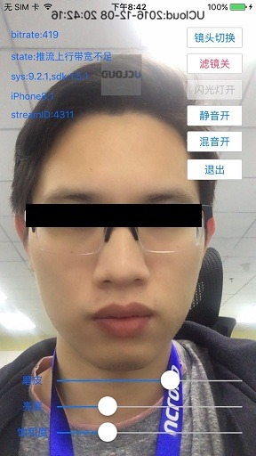

# [UCloud Live iOS SDK]()



- 1 [功能特性](#1)
    - 1.1 [推流功能](#1.1)
- 2 [集成介绍](#2)
    - 2.1 [系统要求](#2.1)
    - 2.2 [下载集成](#2.2)
    - 2.3 [基础集成](#2.3)
    - 2.4 [推流库集成](#2.4)
    - 2.5 [播放器接入](#2.5)
- 3 [使用进阶](#3)
    - 3.1 [参数配置](#3.1)
    - 3.2 [视频滤镜渲染](#3.2)
- 4 [API介绍](#4)
    - [参数设置](#4.1)
    - [推流控制](#4.2)
    - [信息回调](#4.3)
    - [枚举](#4.4)
- 5 [SDK升级历史信息文档变更](#5)
- 6 [反馈和建议](#6)

<a name="1"></a>
## 一. 功能特性

<a name="1.1"></a>
### 1.1 推流功能
- [x] H.264硬编码
- [x] AAC 音频硬编码
- [x] RMTP协议直播推流
- [x] 提供基于GPUImage的美颜滤镜，并支持调节磨皮，美白，红润度
- [x] 支持自定义滤镜
- [x] 支持多分辨率设置
- [x] 自由码率设置
- [x] 自适应网络带宽码率调整
- [x] 弱网丢帧策略
- [x] 延时累积消除
- [x] 横竖屏推流
- [x] 自动对焦
- [x] 静音/取消静音
- [x] 前后置摄像头切换
- [x] 在线API文档支持，提供 HeaderDoc 文档

<a name="2"></a>
## 二. 集成介绍

<a name="2.1"></a>
### 2.1 系统要求
* 最低支持iOS版本：推流端iOS 8.0  播放端iOS7.0
* 最低支持iPhone型号：推流端iPhone 4s，播放端iPhone 4
* 支持CPU架构： armv7,arm64,i386,x86_64
* 含有i386和x86_64模拟器版本的库文件，推流功能无法在模拟器上工作，播放功能完全支持模拟器。  

<a name="2.2"></a>
### 2.2 下载集成
```
git clone https://github.com/umdk/UCDLive_iOS.git
```

目录结构：  
- demo	: UCDLive演示demo，展示本SDK的主要接口使用  
- doc/docset : appleDoc风格接口文档，安装后可在Xcode中直接查看，亦可在Dash APP上查看使用  
- doc/html : appleDoc风格网页版接口文档，可直接点击index.html查看  
- lib/Player : 直播播放器静态库和相关头文件  
- lib/Recorder : 推流静态库和相关头文件  

<a name="2.3"></a>
### 2.3 基础集成

<a name="2.3.1"></a>
#### 2.3.1 导入静态库

将lib文件夹下的Recorder直接拉到Xcode的工程中；

*Recorder文件夹中相关文件意义:  

| 类文件                             | 描述                                 |
| ------------------------------- | ---------------------------------- |
| CameraServer.h                  | 直播推流类，包含视频数据采集和音频数据相关采集，数据推流服务器操作等 |
| UCloudRecorderTypeDef.h         | 直播推流所需常量及配置信息                      |
| libUCloudMediaRecorder.a        | 直播推流静态库                            |
| NSString+UCloudCameraCode.h     | 直播状态返回码                            |
| FilterManager.h/FilterManager.m | 滤镜管理器                              |
| Filter文件夹                       | 所有滤镜库，包含美颜滤镜                       |

<a name="2.3.2"></a>
#### 2.3.2 依赖库说明 

 添加libUCloudMediaRecorder.a所需引用的系统 framework,如下: 

| framework              |
| ---------------------- |
| VideoToolbox.framework |
| CoreMedia.framework    |
| AVFoundation.framework |
| AudioToolbox.framework |
| libz.thd、 libc++.tbd   |

<a name="2.3.3"></a>
#### 2.3.3 iOS9中ATS配置

由于iOS9引入了AppTransportSecurity(ATS)特性，要求App访问的网络使用HTTPS协议，如果不做特殊设置，http请求会失败，所以需要开发者在工程中增加设置以便可以发送http请求，如下：

在info plist中增加字段：

\< key\>NSAppTransportSecurity\< /key\>

\< dict\>

 \< key\>NSAllowsArbitraryLoads\< /key\>

 \< true\>

\< /dict\>


<a name="2.3.4"></a>
#### 2.3.4 iOS10中麦克风、摄像头权限获取

由于iOS10要求App使用麦克风、摄像头时，需要对相应的设备获得权限，如下：

在info plist中增加字段：

\<key\>NSCameraUsageDescription\</key\>

\<string\>允许此权限才能使用相机功能\</string\>

\<key\>NSMicrophoneUsageDescription\</key\>

\<string\>允许此权限才能录音\</string\>

<a name="2.4"></a>
### 2.4 推流库集成

<a name="2.4.1"></a>
#### 2.4.1 添加头文件到需要使用SDK的文件中
```
#import "CameraServer.h"
#import "FilterManager.h"
#import "NSString+UCloudCameraCode.h"
```

<a name="2.4.2"></a>
#### 2.4.2 设置AccessKey，定义推流地址和播放地址

demo中的推流地址仅供测试使用，如需更换推流域名地址，请[发邮件给我们](#6)进行授权，详情看ViewController.h  

```
#define AccessKey @"publish3-key"

推流地址  
#define RecordDomain(id) [NSString stringWithFormat:@"rtmp://publish3.cdn.ucloud.com.cn/ucloud/%@", id]; 

//播放地址，支持http-flv、RTMP、hls播放  
#define PlayDomain(id) [NSString stringWithFormat:@"http://vlive3.rtmp.cdn.ucloud.com.cn/ucloud/%@.flv", id];  
//#define PlayDomain(id) [NSString stringWithFormat:@"rtmp://vlive3.rtmp.cdn.ucloud.com.cn/ucloud/%@", id];  
//#define PlayDomain(id) [NSString stringWithFormat:@"http://vlive3.hls.cdn.ucloud.com.cn/ucloud/%@/playlist.m3u8", id];
```

<a name="2.4.3"></a>
#### 2.4.3 启动推流及状态回调处理

```
//配置SDK推流鉴权Key

[[CameraServer server] setSecretKey:AccessKey];

//配置推流地址、美颜滤镜
[[CameraServer server] configureCameraWithOutputUrl:path filter:originalFilters messageCallBack:^(UCloudCameraCode code, NSInteger arg1, NSInteger arg2, id data) {
                                            
                                            [weakSelf handlerMessageCallBackWithCode:code arg1:arg1 arg2:arg2 data:data weakSelf:weakSelf];
                                            
                                        } deviceBlock:^(AVCaptureDevice *dev) {
                                            
                                            [self handlerDeviceBlock:dev weakSelf:weakSelf];
                                            
                                        } cameraData:^CMSampleBufferRef(CMSampleBufferRef buffer) {
                                            //如果不需要裸流，不建议在这里执行操作，将增加额外的功耗
                                            return nil;
                                        }];
```
```

//推流端回调信息处理

- (void)handlerMessageCallBackWithCode:(UCloudCameraCode)code arg1:(NSInteger)arg1 arg2:(NSInteger)arg2 data:(id)data weakSelf:(ViewController *)weakSelf

{ 

 if (code == UCloudCamera_Permission)
    {
        UIAlertView *alterView = [[UIAlertView alloc] initWithTitle:@"相机授权" message:@"没有权限访问您的相机，请在“设置－隐私－相机”中允许使用" delegate:nil cancelButtonTitle:@"取消" otherButtonTitles:nil, nil];
        [alterView show];
        weakSelf.recordBtn.enabled = YES;
    }
    else if (code == UCloudCamera_Micphone)
    {
        [[[UIAlertView alloc] initWithTitle:@"麦克风授权" message:@"没有权限访问您的麦克风，请在“设置－隐私－麦克风”中允许使用" delegate:nil cancelButtonTitle:@"取消" otherButtonTitles:nil, nil] show];
        weakSelf.recordBtn.enabled = YES;
    }
    else if (code == UCloudCamera_SecretkeyNil)
    {
        UIAlertView *alert = [[UIAlertView alloc] initWithTitle:@"Warning" message:@"密钥为空" delegate:self cancelButtonTitle:@"OK" otherButtonTitles:nil, nil];
        [alert show];
        [weakSelf setBtnStateInSel:1];
    }
    else if (code == UCloudCamera_AuthFail)
    {
        NSDictionary *dic = data;
        NSError *error = dic[@"error"];
        NSLog(@"errcode:%@\n msg:%@\n errdesc:%@", dic[@"retcode"], dic[@"message"], error.description);
        weakSelf.recordBtn.enabled = YES;
    }
    else if (code == UCloudCamera_PreviewOK)
    {
    	 //摄像头准备完成，开启预览
        [self.videoView removeFromSuperview];
        self.videoView = nil;
        [weakSelf startPreview];
    }
    else if (code == UCloudCamera_PublishOk)
    {
    	 //发布操作准备完成，详细代码可以参照sdk使用demo
        [[CameraServer server] cameraStart];
        [weakSelf setBtnStateInSel:3];
        weakSelf.recordBtn.enabled = YES;
        
        [weakSelf.filterManager setCurrentValue:weakSelf.filterValues];
    }
    else if (code == UCloudCamera_StartPublish)
    {
    	// 开始发布，详细代码可以参照sdk使用demo
    }
    else if (code == UCloudCamera_OUTPUT_ERROR)
    {
        // 推流出错，详细代码可以参照sdk使用demo
    }
    else if (code == UCloudCamera_BUFFER_OVERFLOW)
    {
        //当前上传网速不给力，详细代码可以参照sdk使用demo
    }
}

- (void)handlerDeviceBlock:(AVCaptureDevice *)dev weakSelf:(UIViewController *)weakSelf

{

}

```
```
//开启推流预览

- (void) startPreview
{
    UIView *cameraView = [[CameraServer server] getCameraView];
    cameraView.backgroundColor = [UIColor whiteColor];
    [self.view addSubview:cameraView];
    [self.view sendSubviewToBack:cameraView];
    self.videoView = cameraView;
}
```

<a name="2.4.4"></a>
#### 2.4.4 关闭采集推流
```

[[CameraServer server] shutdown:^{
        if (weakSelf.videoView)
        {
            [weakSelf.videoView removeFromSuperview];
        }
        weakSelf.videoView = nil;
    }];
```

<a name="2.5"></a>
### 2.5播放器接入

<a name="2.5.1"></a>
#### 2.5.1 引入静态库

播放器包含ffmpeg库，已知在含有ffmpeg的第三方库情况下无法正常运行,可以尝试在编译选项**Other linker Flags**中加入**-force_load**来解决冲突，但不推荐使用。Player文件夹放置的是直播云播放器库，（如果已经有播放器库，可以不添加，自行配置播放器）将Player直接拉进Xcode工程目录中

*Player文件夹中相关文件意义:

| 类文件                    | 描述           |
| ---------------------- | ------------ |
| UCloudMediaPlayer.h    | 播放器控制类       |
| UCloudMediaPlayback.h  | 播放器通知类       |
| libUCloudMediaPlayer.a | 播放器静态库       |
| UCloudPlayback.h       | 播放器播放类       |
| UCloudMediaModule.h    | 播放器显示控制类     |
| Filter文件夹              | 所有滤镜库，包含美颜滤镜 |


*引入**PlayerUI**，**PlayerUI**是项目中的播放器UI及其管理器类，用户可以自行修改使用。

<a name="2.5.2"></a>
#### 2.5.2 集成播放器

<a name="2.5.2.1"></a>
##### 2.5.2.1 引入头文件
```
#import "UCloudMediaPlayer.h"
#import "UCloudMediaViewController.h"
#import "PlayerManager.h"
```
<a name="2.5.2.2"></a>
##### 2.5.2.2 开始播放直播流
```
self.playerManager = [[PlayerManager alloc] init];
self.playerManager.view = self.view;
self.playerManager.viewContorller = self;
[self.playerManager setPortraitViewHeight: self.view.frame.size.height];
[self.playerManager buildMediaPlayer:self.pathTextField.text];
```
<a name="2.5.2.3"></a>
##### 2.5.2.3 关闭播放器
```
[self.playerManager.mediaPlayer.player.view removeFromSuperview];
[self.playerManager.controlVC.view removeFromSuperview];
[self.playerManager.mediaPlayer.player shutdown];
self.playerManager.mediaPlayer = nil;
```
<a name="3"></a>
## 三 使用进阶

<a name="3.1"></a>
### 3.1 参数配置
当你要深入理解 SDK 的一些参数及有定制化需求时，可以从高级功能部分中查询阅读。

<code>width、height</code>
默认为竖屏方式设置，宽高为360*640，视频宽高比按照9：16进行设置

<code>fps</code> 帧率，即每一秒所包含的视频帧数，默认15，有效范围[1~30], 超出会提示参数错误;

<code>bitrate</code> 音频和视频总比特率，默认UCloudVideoBitrateMedium = 800，音频码率为128kps,可自行设置，该属性的单位为kbps(kilo bits per second)，视频码率高则画面较清晰，低则画面较模糊，同时数据亦是如此，码率高数据大，码率低数据小；

<code>captureDevicePos</code> 摄像头位置，默认打开前置摄像头；

<code>muted</code> 是否开启静音，默认NO

<code>videoOrientation</code> 视频推流方向，只在采集初始化时设置有效，默认UIDeviceOrientationPortrait；

<code>reconnectInterval</code> 重推流间隔,默认5秒

<code>reconnectCount</code>重推流次数，默认3次，如果需要不做重推操作，可将此参数设置为0；重推流间隔和次数可根据app场景自行进行设置调整；

<a name="3.2"></a>
### 3.2 视频滤镜渲染

我们提供了两种不同美颜滤镜算法（UCloudGPUImageBeautyFilter和UCloudGPUImageBeautyFilter2）及各种基于GPUImageView的滤镜，用户可以根据自行情况进行选择使用，或者自行编写基于GPUImage的算法；

<a name="4"></a>
## 四 API介绍

<a name="4.1"></a>
### 4.1 参数配置
```
/*!

 @property width

 @abstract 视频宽，默认360

 */

@property (assign, nonatomic) int width;

/*!

 @property height

 @abstract 视频高，默认640

 */

@property (assign, nonatomic) int height;

/*!

 @property fps

 @abstract 帧率(15\20\25\30)，默认15

 @discussion video frame per seconds 有效范围[1~30], 超出会提示参数错误

 */

@property (assign, nonatomic) int fps;

/*!

 @property bitrate

 @abstract 音频和视频总比特率UCloudVideoBitrate

 @discussion 默认UCloudVideoBitrateMedium，可自行设置，该属性的单位为kbps(kilo bits per seccond)

 @discussion 视频码率高则画面较清晰，低则画面较模糊，同时数据亦是如此，码率高数据大，码率低数据小

 */

@property (assign, nonatomic) int bitrate;

/*!

 @property captureDevicePos

 @abstract 摄像头位置，默认打开前置摄像头

 */

@property (assign, nonatomic) AVCaptureDevicePosition captureDevicePos;

/*!

 @property muted

 @abstract 是否静音，默认NO

 */

@property (nonatomic, assign) BOOL muted;

/*!

 @property videoOrientation

 @abstract 视频推流方向

 @discussion 只在采集初始化时设置有效，默认UIDeviceOrientationPortrait

 */

@property (nonatomic, assign) UCloudVideoOrientation videoOrientation;

/*!

 @property reconnectInterval

 @abstract 重推流间隔,默认5秒

 */

@property (nonatomic, assign) NSTimeInterval reconnectInterval;

/*!

 @property reconnectCount

 @abstract 重推流次数，默认3次

 @discussion 如果需要不做重推操作，可将此参数设置为0

 */

@property (nonatomic, assign) NSInteger reconnectCount;
```

<a name="4.2"></a>
### 4.2 推流控制

/*!

 @method cameraPrepare

 @abstract 打开摄像头预览，不进行推流上传

 */

- (void)cameraPrepare;

/*!

 @method cameraStart

 @abstract 开始录像采集推流上传

 @return 返回操作结果

 */

- (BOOL)cameraStart;

/*!

 @method cameraRestart

 @abstract 推流失败之后重新推流

 */

- (void)cameraRestart;

/*!

 @method shutdown

 @abstract 关闭录像停止推流

 @param completion 关闭成功回调函数

 */

- (void)shutdown:(void(^)(void))completion;

/*!

 @method getCameraView

 @abstract 获取采集图像

 @return 采集图像视图

 */

- (UIView*)getCameraView;

/*!

 @method initializeCameraViewFrame:

 @abstract 设置采集图像显示的frame

 @param frame 显示图像的大小

 @discussion 如果需要设置显示图像的frame，iOS8以下请在此先设置，直接使用getCameraView方法获取view进行设置是无作用的，iOS8以上两者都可设置frame

 */

- (void)initializeCameraViewFrame:(CGRect)frame;

/*!

 @method changeCamera

 @abstract 切换摄像头

 */

- (void)changeCamera;

/*!

 @method outBitrate

 @abstract 编码后的实际码率

 @return 码率值，包括视频码率和音频码率

 */

- (NSString *)outBitrate;

/*!

 @method setTorchState:

 @abstract 设置手电筒状态

 @param state 状态

 @return 设置是否成功

 */

- (BOOL)setTorchState:(UCloudCameraState)state;

/*!

 @method currentCapturePosition

 @abstract 获取当前摄像头的位置

 @return 摄像头位置

 */

- (AVCaptureDevicePosition)currentCapturePosition;

/*!

 @method addFilters:

 @abstract 添加滤镜组

 @param filters 滤镜数组

 */

- (void)addFilters:(NSArray *)filters;

/*!

 @method openFilter

 @abstract 打开美颜功能

 */

- (void)openFilter;

/*!

 @method closeFilter

 @abstract 关闭美颜功能

 */

- (void)closeFilter;

<a name="4.3"></a>
### 4.3 信息回调  

/*!

 @abstract 推流状态回调

 */

typedef void(^CameraMessage)(UCloudCameraCode code, NSInteger arg1, NSInteger arg2, id data);

// 相机回调

typedef void(^CameraDevice)(AVCaptureDevice *dev);

typedef CMSampleBufferRef (^CameraData)(CMSampleBufferRef buffer);

<a name="4.4"></a>
### 4.4 枚举 

typedef NS_ENUM(NSInteger, UCloudCameraCode)

{

 UCloudCamera_COMPLETED =0,

 UCloudCamera_FILE_SIZE = 1,

 UCloudCamera_FILE_DURATION = 2,

 UCloudCamera_CUR_POS = 3,

 UCloudCamera_CUR_TIME = 4,

 UCloudCamera_URL_ERROR = 5,

 UCloudCamera_OUT_FAIL = 6,

 // 推流开始

 UCloudCamera_STARTED = 7,

 UCloudCamera_READ_AUD_ERROR = 8,

 UCloudCamera_READ_VID_ERROR = 9,

 /// 推流错误

 UCloudCamera_OUTPUT_ERROR = 10,

 /// 推流停止

 UCloudCamera_STOPPED = 11,

 UCloudCamera_READ_AUD_EOS = 12,

 UCloudCamera_READ_VID_EOS = 13,

 /// 推流带宽

 UCloudCamera_BUFFER_OVERFLOW = 14,

 /// SDK 密钥为空

 UCloudCamera_SecretkeyNil = 15,

 /// 推流域名为空

 UCloudCamera_DomainNil = 16,

 /// SDK 鉴权失败

 UCloudCamera_AuthFail = 17,

 /// SDK 鉴权返回IP列表为空

 UCloudCamera_ServerIpError = 18,

 /// 预览视图准备好

 UCloudCamera_PreviewOK = 19,

 /// 底层推流配置完毕

 UCloudCamera_PublishOk = 20,

 UCloudCamera_StartPublish = 21,

 /// SDK dig错误

 UCloudCamera_DigError = 22,

 /// 推流ID已被占用

 UCloudCamera_AlreadyPublish = 23,

 /// 推流url对应的服务器连接失败

 UCloudCamera_CannotConnect = 24,

 /// 摄像头权限

 UCloudCamera_Permission = 998,

 /// 麦克风权限

 UCloudCamera_Micphone = 999,

};

typedef NS_ENUM(NSInteger, UCloudCameraState)

{

 /// 关闭

 UCloudCameraCode_Off,

 /// 打开

 UCloudCameraCode_On,

 /// 自动

 UCloudCameraCode_Auto,

};

/**

* @abstract 视频采集方向

 */

typedef NS_ENUM(NSInteger, UCloudVideoOrientation) {

 UCloudVideoOrientationPortrait = UIDeviceOrientationPortrait,

 UCloudVideoOrientationPortraitUpsideDown = UIDeviceOrientationPortraitUpsideDown,

 UCloudVideoOrientationLandscapeRight = UIDeviceOrientationLandscapeRight,

 UCloudVideoOrientationLandscapeLeft = UIDeviceOrientationLandscapeLeft

};

/*!

 @enum UCloudVideoBitrate

 @abstract 采集的视频流码率，包括视频流码率和音频流码率，音频流码率默认128kbps

 */

typedef NS_ENUM(NSInteger, UCloudVideoBitrate) {

 UCloudVideoBitrateLow = 400,

 UCloudVideoBitrateNormal = 600,

 UCloudVideoBitrateMedium = 800,

 UCloudVideoBitrateHigh = 1000

};

<a name="5"></a>
## 五 SDK升级历史信息文档变更

| 版本号   | 发布日期       | 说明                                       |
| ----- | ---------- | ---------------------------------------- |
| 1.6.3 | 2017.05.05 |1、增加推流本地日志输出，新增API见CameraServer.h<br/>2、sdk外层增加对demo的友盟统计<br/>3、播放器更新至1.5.1|
| 1.6.2 | 2017.04.18 |1、调整推流端SDK、播放器SDK体验质量采集<br/> 2、播放器SDK加入本地日志模块，更方便普通用户定位问题，具体API详见UCloudMediaPlayer.h|
| 1.6.1 | 2017.03.10 |1、增加前置摄像头出去的流翻转API streamMirrorFrontFacing<br/> 2、统一rtmp发送头部，与android一致<br/> 3、修复8.1系统下的推流兼容性问题<br/> 4、播放器增加对speex音频播放支持|
| 1.6.0 | 2017.01.25 | 1、全面支持bitcode（静态库体积会变大，但是不影响最终ipa的体积，bitcode只有在上传applestore后才有效果）<br/> 2、升级播放器解码内核<br/> 3、优化摄像头频繁切换时的处理<br/> 4、优化首次安装app时的cpu占用率|
| 1.5.3 | 2016.12.23 | 1、增加获取当前流截图接口getStreamShot<br/> 2、优化推流鉴权校验逻辑|
| 1.5.2 | 2016.12.15 | 1、播放器增加https播放的支持<br/>2、优化前后台切换摄像头资源的使用<br/> 3、优化推流端横屏模式下的适配<br/> 4、修复推流时接听/拒绝来电的问题<br/>5、Demo增加针对HLS播放设置不同的参数示例<br/>6、修复8.3系统下推流时预览画面不角度不对的问题|
| 1.5.1 | 2016.12.05 | 1、增加水印功能<br/> 2、增加混音功能<br/> 3、调整UI布局及文字描述<br/> 4、增加播放器delayOptimization、cacheDuration、bufferDuration、prepareTimeout、getAVFrameTimeout设置，详见UCloudMediaPlayer.h文件<br/>|
| 1.5.0 | 2016.10.20 | 1、优化底层推流模块结构<br/> 2、增加 推流与服务器异常断开消息(详见UCloudRecorderTypeDef.h)，sdk内部已做重连处理，外部不需要做操作 |
| 1.4.1 | 2016.10.14 | 1、暂时关闭降噪功能<br/> 2、UCloudMediaPlayer.h增加rtmpSubscribe属性设置来满足海外CDN播放前需要发送FCSubscribe命令的需求<br/> 3、优化后台切到前台重推流的场景<br/> 4、修复电话呼入未接通时，对方主动挂断电话后回到app推流失败的问题 |
| 1.4.0 | 2016.09.08 | 1、推流时加入声音降噪处理<br/> 2、播放器端优化hls播放流畅度      |
| 1.3.9 | 2016.08.29 | 1、提前摄像头UCloudCamera_PreviewOK消息通知；<br/>2、调整推出去的流为预览时的垂直翻转；<br/>3、sdk&demo增加对通知栏下拉操作的处理 |
| 1.3.8 | 2016.08.24 | 拆分CameraServer.h文件为CameraServer.h&UCloudRecorderTypeDef.h |
| 1.3.7 | 2016.08.18 | 1、调整demo重推、重播逻辑；<br/>2、修复demo中filterValues数组在ios7下的问题 |
| 1.3.6 | 2016.07.29 | 更新播放器库(libUCloudMediaPlayer.a)，库主要优化弱网下音频的播放体验 |
| 1.3.5 | 2016.07.25 | 增加重推和重播功能                                |
| 1.3.4 | 2016.07.19 | 1、优化推流端在ios9.2上的内存占用；<br/>2、更新播放器库，优化弱网下声音的播放问题 |
| 1.3.3 | 2016.07.12 | 1、调整采集时摄像头的显示模式，适配所有设备上能全屏显示无黑边；<br/>2、增加横竖屏推流模式 |
| 1.3.2 | 2016.06.30 | CameraServer.h 增加UCloudCameraCode 23（推流ID已被占用）、24（推流url无法连接）；播放器增加直播追赶策略 |
| 1.3.1 | 2016.06.23 | 1、优化推流时打开摄像头的流程；<br/>2、增加直播推流的模拟器库版本     |
| 1.3.0 | 2016.06.16 | 1、修改CameraServer.h bitrate属性值的含义，抛弃以前的计算方式，改为总的音视频码率，单位为kbps，默认800kbps，详细可见ViewController.m 235行；<br/>2、新增支持直播过程中调整码率设置；<br/>3、新增UCloudGPUImageBeautyFilter2美颜滤镜，增加人脸边缘检测算法，磨皮效果更自然，提供磨皮、亮度、饱和度三种参数设置，可以在直播过程中动态调整美颜效果 |
| 1.2.9 | 2016.06.07 | 修复iphone6s推流有噪音的问题，增加推流时静音功能、手电筒功能，调整按钮布局、按钮文字描述 |
| 1.2.8 | 2016.05.19 | 增加美颜滤镜开关，showMediaPlayer方法增加了urltype参数   |
| 1.2.7 | 2016.05.04 | sdk内部增加对摄像头麦克风权限的获取校验，处理特定场景下播放与推流渲染的问题，优化对蓝牙设备、耳机、扬声器的切换处理 |
| 1.2.6 | 2016.04.26 | 推流界面增加更多推流信息，优化推流时前台后台切换的问题              |
| 1.2.5 | 2016.04.21 | 修改推流界面，增加debug信息                         |
| 1.2.1 | 2016.03.11 | 优化推流稳定性、优化demo体验、优化demo的滤镜效果预览流畅度、实时性    |
| 1.1.1 | 2016.01.20 | 加入滤镜功能                                   |
| 1.0.0 | 2015.12.30 | 文档初稿，基础推流功能，自定义宽高、帧率、比特率                 |

<a name="6"></a>
## 六 反馈和建议
  - 主 页：<https://www.ucloud.cn/>
  - issue：[查看已有的 issues 和提交 Bug[推荐]](https://github.com/umdk/UCDLive_iOS/issues)
  - 邮 箱：[sdk_spt@ucloud.cn](mailto:sdk_spt@ucloud.cn)

<a name="6.1"></a>
### 问题反馈参考模板  

| 名称    | 描述                                   |
| ----- | ------------------------------------ |
| 设备型号  | iphone7                              |
| 系统版本  | iOS 10                               |
| SDK版本 | v1.5.0                               |
| 问题描述  | 描述问题现象                               |
| 操作路径  | 经过了什么样的操作出现所述的问题                     |
| 附 件   | 文本形式控制台log、crash报告、其他辅助信息（推流界面截屏或其他） |
